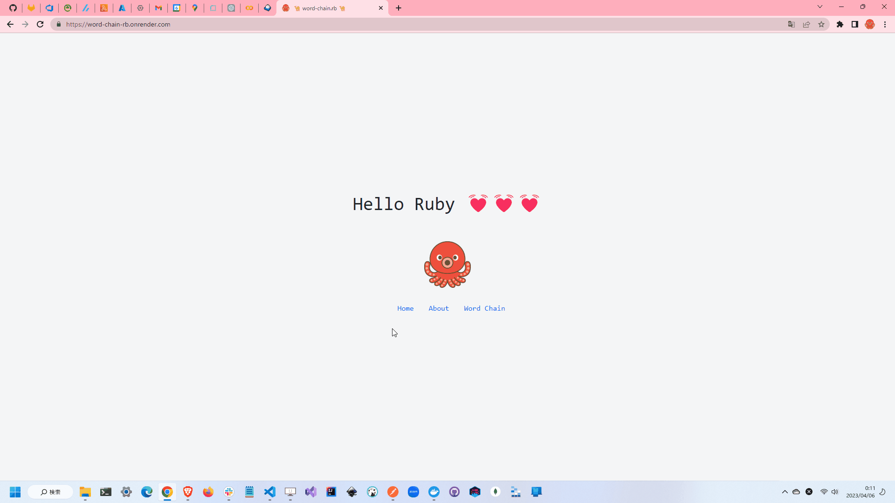

# word-chain.rb

🥭🥭🥭 Rubyで最長しりとりを探すプログラム！  
"Ruby on Rails(API mode)"と"Next.js(SSR)"で開発したWebアプリです。  

  

## 実行方法

```shell
docker build -t word-chain-rb .
docker run --rm -d -p 8000:8000 --name word-chain-rb word-chain-rb
```

## 使用している技術

- Ruby
  - Ruby on Rails(API mode)
- Next.js
  - React
  - TypeScript
- Docker
